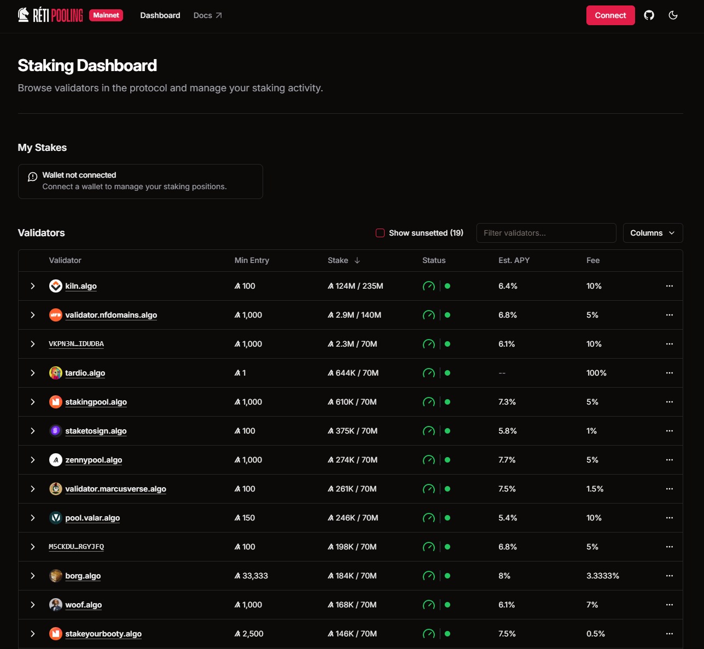

# Example Lora Visualizations

## Adding Stake

Link to this [Lora Explorer](https://lora.algokit.io/testnet/block/41487451/group/Tz6YY6kcJsnpDLGhLSOk1g08Eau%2FWd4NRouLAvDCTD8%3D) eg of adding Stake

Notice the payment is sent to the Validator contract, which then determines which pool to send it to, passing that stake on to the chosen validator's pool.

<figure><figcaption></figcaption></figure>

## Unstaking

Link to this [Lora Explorer](https://lora.algokit.io/testnet/block/41487434/group/ejgcuqRaYPkZ2Ev9UjItMbeHXP78OhIJjIcSIFVWRDo%3D) eg of unstaking

Notice the payment from the staking pool back to the staker for the amount being unstaked.  The validator contract is then called to update metadata.

<figure><figcaption></figcaption></figure>

## Validator performing Epoch Update

Link to this [Lora Explorer](https://lora.algokit.io/testnet/block/41486258/group/E%2BlDoHbZGpXb8qd%2BPRHTFnUjW9hw4FZg5xnUOfFHvOc%3D) Epoch Update eg&#x20;

Notice the payment from the staking pool to the valdiator's commission address  (in this example its the same as the 'manager' address calling it but likely would be different).

Many OpUp operations are necessary to cover the opcode costs.

<figure><figcaption></figcaption></figure>
